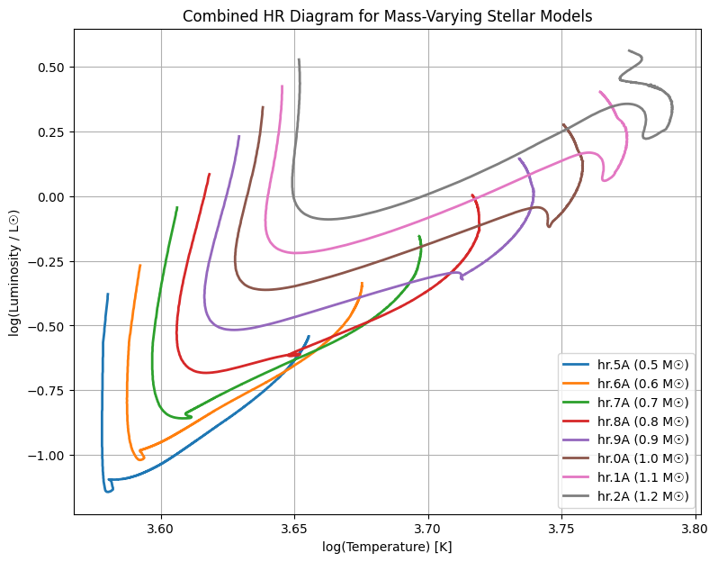
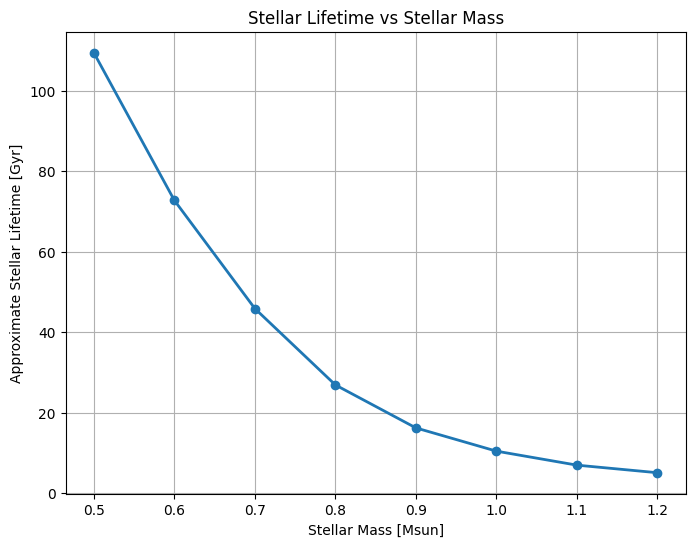

# Stellar Habitable Zone Evolution

This project models how the habitable zone around a star changes as stellar luminosity evolves over time. Using stellar evolution track data, the code estimates inner and outer habitable zone boundaries and visualizes how those regions shift for stars of different masses.

The project was developed as part of coursework in Stellar Astrophysics at Arizona State University and demonstrates scientific computing, astrophysical modeling, data analysis, and visualization using Python.

---

## Project Snapshot

**Course:** AST 321 – Stellar & Planetary Astrophysics  
**Institution:** Arizona State University  
**Language:** Python  
**Libraries:** NumPy, Pandas, Matplotlib

---

## Example Output

### Combined HR Diagram for Mass-Varying Stellar Models



This figure shows the evolution of habitable zone boundaries for stellar models ranging from 0.5 to 1.2 solar masses. Dashed lines represent inner habitable zone boundaries, while solid lines represent outer boundaries.

### Combined Habitable Zone Evolution


## Results

The analysis demonstrates how habitable zone boundaries evolve as stellar luminosity changes over time.

## Additional Analysis

### Stellar Lifetime vs Stellar Mass



This analysis illustrates the relationship between stellar mass and stellar lifetime. Higher-mass stars evolve more rapidly and therefore have significantly shorter lifetimes than lower-mass stars.

Key observations:

- Higher-mass stars exhibit wider habitable zones but evolve more rapidly.
- Lower-mass stars maintain stable habitable zones for significantly longer periods.
- Habitable zone distance scales with stellar luminosity and shifts throughout stellar evolution.

### Key Outputs

- Habitable zone evolution for stars from 0.5–1.2 solar masses
- Combined habitable zone comparison plots
- Stellar lifetime estimates
- HR diagrams for stellar evolution tracks

## Key Features

- Reads stellar evolution track data
- Calculates habitable zone boundaries
- Models habitable zone evolution over billions of years
- Compares stars from 0.5–1.2 solar masses
- Estimates stellar lifetimes
- Produces publication-quality visualizations

---

## Scientific Background

The habitable zone (HZ) is the region around a star
where liquid water may exist on the surface of a planet.

As stars evolve, their luminosity changes, causing
the habitable zone to migrate over time.

This project uses stellar evolution data to quantify
those changes and compare the habitability potential
of stars with different masses.

---

## Physical Model

The habitable zone distance is estimated using:

d = sqrt(L / S_eff)

where:

- d = orbital distance (AU)
- L = stellar luminosity (solar units)
- S_eff = effective stellar flux limit

As a star evolves and its luminosity changes, the habitable zone moves accordingly.

---

## How to Run

Clone the repository:

```bash
git clone https://github.com/jhidalgo-physics-dev/Physics-scientific-computing.git
cd Physics-scientific-computing

pip install -r requirements.txt

python stellar_habitable_zone.py
```

## Skills Demonstrated

- Python Programming
- Scientific Computing
- Astrophysical Modeling
- Data Analysis
- Data Visualization
- Numerical Methods
- Technical Documentation
- Research Computing

---

## Tools Used

- Python
- NumPy
- Pandas
- Matplotlib
- Jupyter Notebook

---

## Future Improvements

- Interactive habitable zone visualizations
- Additional stellar evolution datasets
- Expanded stellar mass ranges
- Exoplanet habitability comparisons
